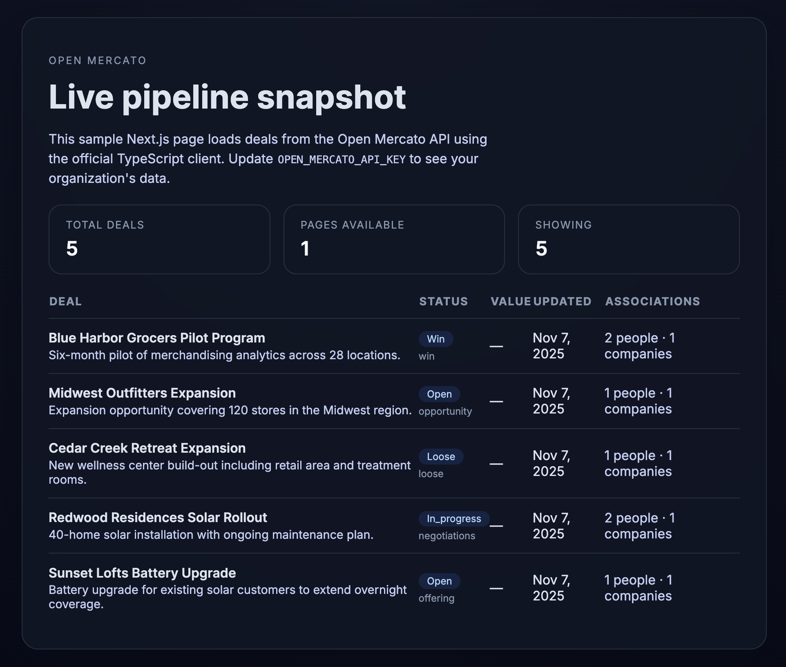

<p align="center">
  
</p>

<p align="center">
  <a href="https://nextjs.org/">
    
  </a>
  <a href="https://www.typescriptlang.org/">
    
  </a>
  <a href="https://nodejs.org/en">
    
  </a>
  <a href="./LICENSE">
    
  </a>
</p>

<p align="center">
  
</p>

# Open Mercato Deals Demo

A minimal Next.js + TypeScript application that calls the Open Mercato API via [`@open-mercato/client`](https://www.npmjs.com/package/@open-mercato/client) and renders the latest deals inside a simple React page.

## Requirements

- Node.js 18.18+ or 20.x
- npm 9+

## Getting started

1. **Install dependencies**

   ```bash
   npm install
   ```

2. **Configure the API key**

   ```bash
   cp .env.local.example .env.local
   ```

   The sample env file already contains the default demo key you shared (`omk_7fb72cd6.4a98a415d4ab444b6b9ead8f75dad500ade109bb6beca257`). Feel free to replace it with your own and restart the dev server whenever you rotate the credential.

3. **Run the dev server**

   ```bash
   npm run dev
   ```

   Visit http://localhost:3000 to see the pipeline snapshot.

## How it works

- `src/lib/deals.ts` instantiates `createOpenMercatoClient`, injects the `OPEN_MERCATO_API_KEY` access token, and exposes a typed `fetchDeals` helper. You can tweak the `DEFAULT_QUERY` object to change the sort, status, or paging parameters passed to `/customers/deals`.
- `src/app/page.tsx` is a server component, so the API key never leaves the backend. It loads the deals at request time (`export const dynamic = 'force-dynamic'`) and renders a compact stats grid and table.
- Styling lives in `src/app/globals.css` to keep the example lightweight—feel free to swap in Tailwind or any other design system.

### Environment variables

| Name | Required | Description |
| --- | --- | --- |
| `OPEN_MERCATO_API_KEY` | ✅ | Bearer token used by `@open-mercato/client`. The provided value in `.env.local.example` is used by default, but you should override it with your organization key when available. |
| `OPEN_MERCATO_API_BASE_URL` | ⛔️ | Optional override for the API base URL. Defaults to `https://demo.openmercato.com/api`, falling back to the package’s built-in heuristics if unset. |

## Available scripts

| Command | Description |
| --- | --- |
| `npm run dev` | Starts the Next.js dev server with hot reload. |
| `npm run build` | Creates an optimized production build. |
| `npm start` | Runs the production server (after `npm run build`). |
| `npm run lint` | Lints the project with ESLint (flat config powered by `eslint-config-next`). |
| `npm run type-check` | Runs `tsc --noEmit` for CI-friendly type safety. |

## Next steps

- Swap the demo token with an organization-specific key.
- Adjust `fetchDeals` to request additional associations (people, companies) or wire up pagination.
- Deploy to Vercel or your preferred host once you are happy with the UI. 
